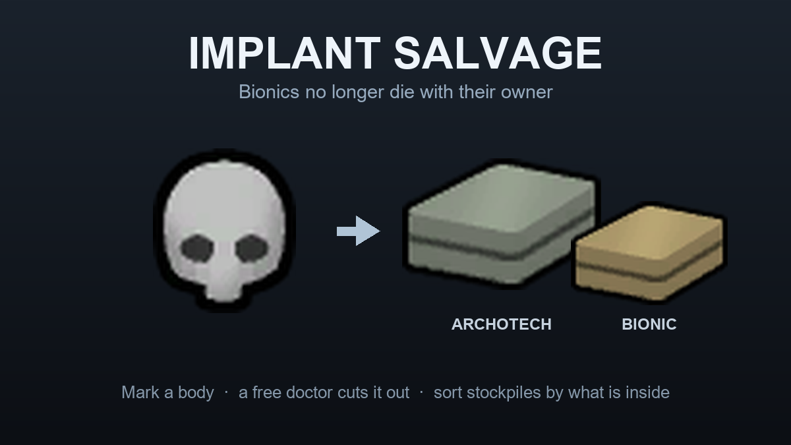

# Implant Salvage

A RimWorld 1.6 mod. Bionics no longer die with their owner.

**[Steam Workshop](https://steamcommunity.com/sharedfiles/filedetails/?id=3790499628)**



---

A raider dies wearing an archotech arm and a bionic heart, and you get nothing. In vanilla those
parts only survive if you take him alive. Implant Salvage lets a doctor cut them out of the body
instead.

- **Right-click a corpse** with a colonist selected to send someone over now, naming the implant and
  the part it sits in.
- **Or mark the body** — select it, hit *Extract implant*, tick what you want. Whichever doctor is
  free gets to it, exactly like vanilla's skull extraction: work priorities are respected, drafted
  pawns are never pulled off a fight, and vanilla's Cancel clears the mark.
- **Botching is possible.** The chance is driven by the same stat real operations use, so traits,
  injuries and blindness all count. A useless doctor wrecks the implant about half the time.
- **Corpses worth salvaging get a marker**, so a battlefield reads at a glance.
- **Stockpiles, crematoria and butcher tables can sort by implant** — take bodies for bionics and
  better, leave the peg legs where they fell.

Implants only. Natural organs are untouched, so there is no organ-harvesting mood or ideology
fallout. Works on humans, xenotypes and ghouls; modded prosthetics are picked up automatically,
because the test is one vanilla field rather than a hardcoded list.

## Requirements

- RimWorld **1.6**
- [Harmony](https://steamcommunity.com/sharedfiles/filedetails/?id=2009463077)

## Building

```
dotnet build Source/ImplantSalvage.csproj
```

Targets `net48` and pulls reference assemblies from `Krafs.Rimworld.Ref`, so no RimWorld install
path is hardcoded and no game DLLs are vendored. The build drops `ImplantSalvage.dll` and the
MultiplayerAPI stub into `Assemblies/`, which is gitignored — it is a build artifact.

## How it is put together

Worth knowing if you are reading the source, because a few things are not the obvious approach:

- **Extraction is a designation, not an ordered job.** `WorkGiver_ExtractImplant` services a plain
  vanilla `Designation`. Plain, not a subclass — `Designation.ExposeData` is not virtual, so a
  subclass carrying extra scribed data is fragile, and a vanilla designation is cleared by vanilla's
  own Cancel for free. Which implants are queued lives in `GameComponent_ImplantSalvage`, with the
  designation treated as the source of truth.
- **The per-stockpile implant picker is hand-drawn into the storage filter tree.** Vanilla's tree
  only nests `ThingCategoryDef`s that contain `ThingDef`s, so special filters always render flat —
  and they are OR'd *exclusions*, which cannot express "accept if at least one implant is allowed".
  `ImplantTreeInStorage` draws its own rows, copying `Listing_Tree`'s geometry so they read as part
  of the tree.
- **Acceptance is any-match.** A corpse is accepted if *at least one* of its implants is allowed
  there. A denied peg leg never turns away a body carrying an allowed bionic arm; denying an implant
  only skips bodies whose sole salvage is that part.
- **Simulation state lives in the save, not in `ModSettings`.** Mod settings are per-player, so
  anything the simulation reads from them desyncs multiplayer. The extraction chances and every
  stockpile's selection are scribed into the game.

`docs/DESIGN.md` has the full reasoning, including the decompile findings the design rests on and a
record of the approach that was abandoned and why.

## Multiplayer

Multiplayer-safe by design and needs no compatibility patch. Every mutation of shared state goes
through a synced method in `ImplantSalvageActions`; the outcome roll is seeded so all clients agree.

Extraction has been confirmed desync-free in a live two-client session. The per-stockpile picker and
cancel syncs carry no randomness but have not had the same test.

## Credits

RimWorld is by Ludeon Studios. The preview image is composed from the game's own sprites.
